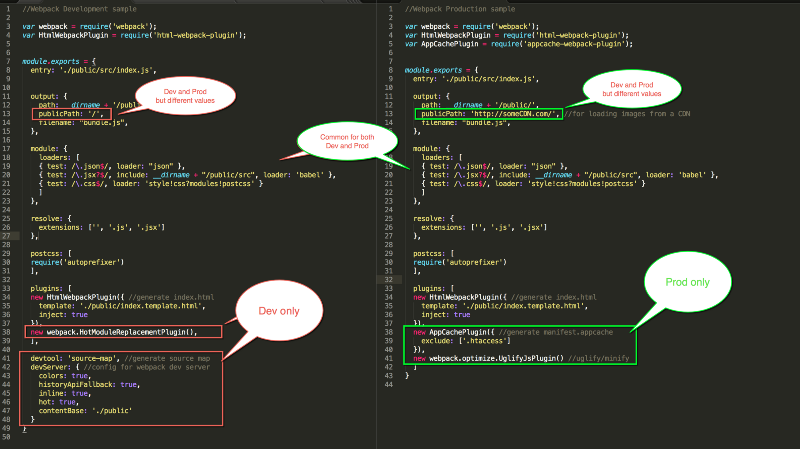

# Webpack - 你需要明白的，没有废话的内容。

# 1. Webpack 的核心理念：

# 1. Development vs Production

Webpack有大量的特性，有些是"development-only"，有些是"production-only"，还有很多是 "Production-and-Development"均适用的。

参见下图：



一般，我们会这样创建一个webpack项目的 `package.json` 文件：

``` javascript
 "script":{
  //npm run build to build production bundles
  “build”: “webpack --config webpack-config-prod.js”,
  //npm run dev to generate development bundles and run dev. server
  “dev”: “webpack-dev-server”
 }
```

# 2. webpack CLI vs webpack-dev-server

webpack 对外暴露两种 interface ，可以使用这两种配置方式对 webpack 进行操作：

1. webpack CLI tool - 默认的 interface，作为 webpack 的一部分安装。
2. webpack-dev-server tool - 一个 nodejs server，你需要单独安装它。

## webpack CLI（Good fro Production Builds）

这个配置方式接受 CLI 和 config 文件两种配置方式。 使用方法：

``` javascript
OPTION 1:
//Install it globally
npm install webpack --g
//Use it at the terminal
$ webpack //<--Generates bundle using webpack.config.js

OPTION 2 :
//Install it locally & add it to package.json
npm install webpack --save
//Add it to package.json's script
“scripts”: {
 “build”: “webpack --config webpack-config-prod.js -p”,
 ...
 }
//Use it by running the following:
npm run builds
```

## webpack-dev-server (Good for Development Builds)

这是一个Express nodejs server，运行在8080端口。这个server在内部调用了webpack。 webpack-dev-server给我们提供了一些额外的功能，极大的增强了开发体验，例如:

1. 刷新浏览器。 i.e. "Live Reloading"
2. 仅替换发生改变的Component。 i.e "Hot Module Replacement" (HMR).

**Usage:**

``` javascript
OPTION 1:
//Install it globally
npm install webpack-dev-server --save
//Use it at the terminal
$ webpack-dev-server --inline --hot

OPTION 2:
// Add it to package.json's script
“scripts”: {
 “start”: “webpack-dev-server --inline --hot”,
 ...
 }
// Use it by running
$ npm start

// Open browser at: http://localhost:8080
```

## Webpack vs webpack-dev-server
